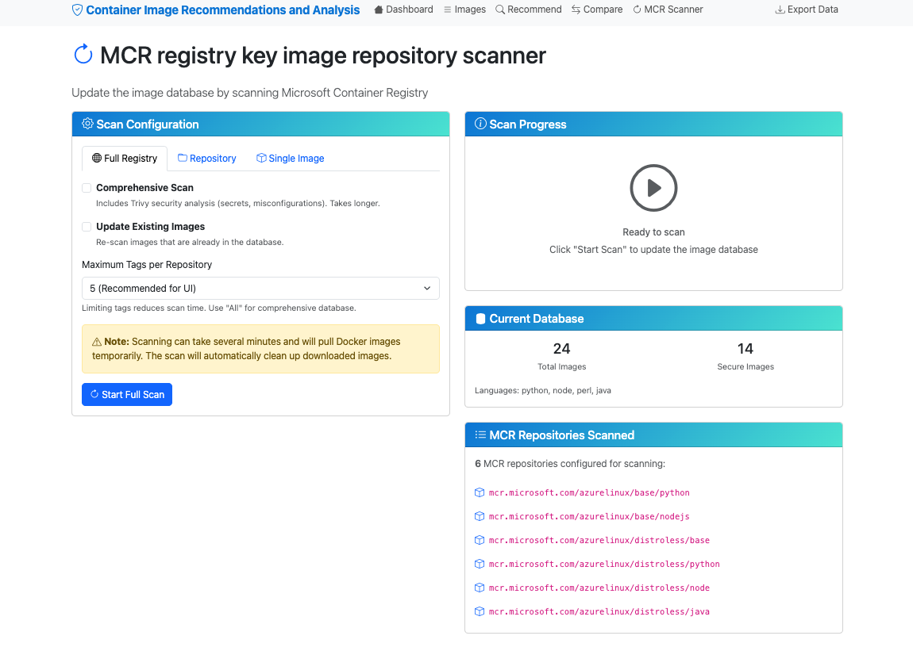

# Container Base Image Recommendation Tool

A comprehensive tool for analyzing and recommending secure container base images from various container registries.

## Architecture

For a detailed overview of the system architecture, including the Web UI, SQLite database, CLI interface, and external tool integrations, see the [Architecture Documentation](docs/images/architecture.md).

## Features

- 🔍 **Image Analysis**: Deep analysis of container images using Syft, Trivy, Gripe, and docker
- 🎯 **Smart Recommendations**: Intelligent matching of user requirements to optimal base images
- 📊 **Registry Scanning**: Automated scanning of container images from various registries
- 🛡️ **Security Focus**: Prioritizes secure, vulnerability-free base images
- 🚀 **Language Support**: Supports Python, Node.js, Java, Go, .NET
- 📦 **Package Ecosystem**: Analyzes package managers and installed libraries
- 💾 **Size Optimization**: Considers image size preferences (minimal, balanced, full)

## Installation

### Prerequisites

**Option 1: Use Dev Container (Recommended)**

If you're using VS Code, you can use the provided dev container which has all dependencies pre-installed:
- Install the [Dev Containers extension](https://marketplace.visualstudio.com/items?itemName=ms-vscode-remote.remote-containers)
- Open the project in VS Code and select "Reopen in Container" when prompted
- All tools (Docker, Syft, Trivy) will be automatically available

**Option 2: Manual Installation**

1. **Docker**: Required for image analysis
   ```bash
   # Install Docker (if not already installed)
   # Follow instructions at https://docs.docker.com/get-docker/
   ```

2. **Syft**: Required for Software Bill of Materials generation
   ```bash
   # Install Syft
   curl -sSfL https://raw.githubusercontent.com/anchore/syft/main/install.sh | sh -s -- -b /usr/local/bin

   # Or using Homebrew (macOS)
   brew install syft
   ```
3. **Trivy**: Required for vulnerability scanning and security analysis
   ```bash
   # Install Trivy
   brew install trivy
   ```

## Quick Start

### Web UI

To use the web interface, [follow these steps](web_ui/README.md).

#### Running in VS Code Dev Container

If you're using VS Code with the provided dev container:

1. **Open in Dev Container**:
   - Ensure you have the [Dev Containers extension](https://marketplace.visualstudio.com/items?itemName=ms-vscode-remote.remote-containers) installed
   - Open the project in VS Code and select "Reopen in Container" when prompted
   - Or use Command Palette (`Ctrl+Shift+P`) → "Dev Containers: Reopen in Container"

2. **Start the Web UI**:
   ```bash
   cd web_ui
   ./start.sh
   ```

3. **Access the Application**:
   - The web server will start on `http://localhost:8080`
   - In VS Code, you'll see a notification to open the port in your browser
   - Click "Open in Browser" or manually navigate to `http://localhost:8080`
   - You can also use the VS Code "Ports" tab to manage forwarded ports

4. **Development Benefits**:
   - All dependencies (Docker, Syft, Trivy) are pre-installed in the container
   - Database will be automatically created if it doesn't exist
   - Hot reload is enabled for development
   - VS Code debugging is fully configured

**Note**: The dev container includes all required tools (Docker, Syft, Trivy) pre-installed, so you can immediately start using the application without additional setup.

## Web UI Screenshots

The following screenshots demonstrate the key features and functionality of the web interface:

### Dashboard Overview


The dashboard provides a comprehensive overview of your container image database, including:
- **Database Statistics**: Total images scanned, package counts, and security metrics
- **Language Distribution**: Visual breakdown of programming language support across images
- **Security Overview**: Summary of vulnerability counts and security levels
- **Quick Navigation**: Easy access to all major features (Recommend, Browse Images, Scan Registry)

### Existing Image Analysis & Recommendations


The "Recommend based on existing image" feature allows you to analyze your current container image and get better alternatives:
- **Existing Image Analysis**: Input your current Docker image name to analyze its security profile and characteristics
- **Automated Discovery**: The tool automatically detects the programming languages, packages, and vulnerabilities in your existing image
- **Intelligent Alternatives**: Get ranked recommendations for more secure base images that meet the same requirements
- **Security Improvements**: See how switching to recommended images can reduce vulnerabilities and improve security posture
- **Seamless Migration**: Recommendations maintain compatibility with your existing application requirements while enhancing security

### Custom Requirements Recommendation
The default recommendation view also provides a comprehensive form-based approach where you can specify your exact requirements:
- **Language Selection**: Choose your programming language (Python, Node.js, Java, Go, .NET, etc.)
- **Version Specification**: Specify exact version requirements for your runtime
- **Package Dependencies**: List required packages and libraries for your application
- **Size Preferences**: Select between minimal, balanced, or full-featured base images
- **Security Level**: Set your security requirements and maximum acceptable vulnerability counts
- **Smart Matching**: Get ranked recommendations with detailed scoring showing how each image matches your criteria

### Recommendation Comparison


The comparison view allows you to:
- **Side-by-Side Analysis**: Compare your existing image with recommended alternatives
- **Security Improvements**: See how recommended images reduce vulnerabilities
- **Size Optimization**: Understand the trade-offs between features and image size
- **Migration Path**: Get clear guidance on switching to more secure base images

### Image Browser and Search


The image browser provides powerful search and filtering capabilities:
- **Comprehensive Listing**: Browse all scanned container images with pagination
- **Advanced Filtering**: Filter by programming language, security level, and custom search terms
- **Quick Overview**: See key metrics like size, vulnerabilities, and supported languages at a glance
- **Detailed Navigation**: Click any image to view comprehensive details

### Detailed Image Information


The detailed image view offers in-depth information including:
- **Complete Metadata**: Image tags, size, creation date, and registry information
- **Security Analysis**: Detailed vulnerability breakdown by severity
- **Package Inventory**: Full list of installed packages and language runtimes
- **Language Support**: Detected programming languages and their versions
- **Recommendation Context**: How this image fits various use cases

### Registry Scanning Interface


The scanning interface allows you to:
- **Individual Image Analysis**: Scan specific container images for detailed analysis
- **Custom Configuration**: Choose between quick scans and comprehensive security analysis
- **Real-time Progress**: Monitor scanning progress with detailed status updates
- **Error Handling**: Clear feedback on any issues encountered during scanning

### Repository Scanning


For bulk operations, the repository scanner provides:
- **Batch Processing**: Scan entire repositories or multiple images at once
- **Flexible Configuration**: Set maximum tags per repository and update preferences
- **Progress Tracking**: Real-time updates on scanning progress across multiple images
- **Database Integration**: Automatic saving of results to the local database

### Comprehensive Registry Scanning


The comprehensive scanning feature enables:
- **Full Registry Coverage**: Scan all configured repositories in any container registry
- **Automated Discovery**: Automatically detect and analyze new image versions
- **Scheduling Options**: Configure scanning frequency and update policies
- **Resource Management**: Efficient handling of large-scale scanning operations with progress monitoring

These screenshots showcase how the web interface makes container security analysis accessible to both technical and non-technical users, providing powerful features through an intuitive interface.
