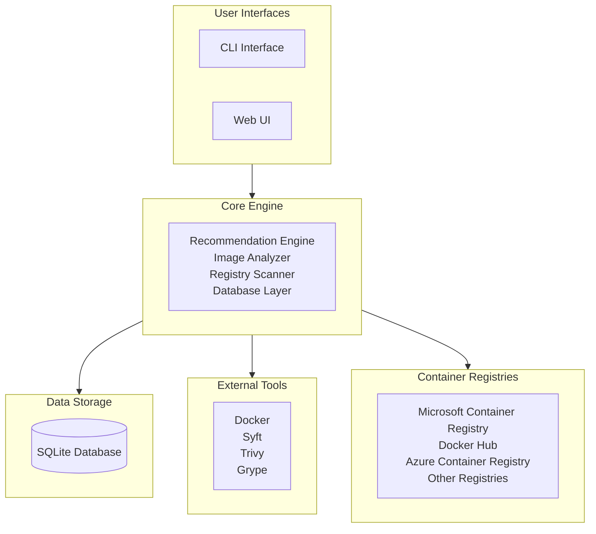

# Container Base Image Recommendation Tool - Architecture

## System Overview

The Container Base Image Recommendation Tool is designed with a modular architecture that provides multiple user interfaces while sharing a common backend and database. The system helps users discover and select secure container base images through intelligent analysis and recommendations.

## High-Level Architecture

## Architecture Components

### User Interfaces

The system provides two primary interfaces for user interaction:

#### Command Line Interface (CLI)
- **Location**: `src/cli.py`
- **Purpose**: Command-line access for technical users and automation
- **Features**: Image recommendation, analysis, scanning, and database operations

#### Web User Interface
- **Location**: `web_ui/app.py`
- **Purpose**: User-friendly web interface for non-technical users
- **Features**: Interactive dashboard, form-based recommendations, image browser, and scanning interface

### Core Engine

The core engine contains all the business logic and processing components:

- **Recommendation Engine** (`src/recommendation_engine.py`): Intelligent matching of user requirements to optimal base images
- **Image Analyzer** (`src/image_analyzer.py`): Deep analysis of container images using external security tools
- **Registry Scanner** (`src/registry_scanner.py`): Automated scanning and discovery of container images from registries
- **Database Layer** (`src/database.py`): Data persistence, querying, and management

### Data Storage

#### SQLite Database
- **Location**: `azure_linux_images.db`
- **Purpose**: Stores all analyzed image data, vulnerabilities, packages, and metadata from scanned container images
- **Content**: Pre-populated with scanned Azure Linux base images and continuously updated through scanning operations
- **Features**: Lightweight, portable, ACID-compliant database with optimized queries

### External Tools

The system integrates with industry-standard security and analysis tools to scan and analyze container images:

- **Docker**: Container image management and inspection
- **Syft**: Software Bill of Materials (SBOM) generation
- **Trivy**: Vulnerability scanning and security analysis
- **Grype**: Additional security scanning for comprehensive coverage

### Container Registries

The tool scans images from multiple container registries and stores the results in the SQLite database:

- **Microsoft Container Registry (MCR)**: Primary focus on Azure Linux images
- **Docker Hub**: Public container images
- **Azure Container Registry**: Private enterprise registries
- **Other Registries**: Any OCI-compliant container registry

## Key Workflows

### 1. Image Recommendation
Users specify requirements through either the CLI or Web UI. The Core Engine queries the SQLite database (which contains pre-scanned images), applies scoring algorithms, and returns ranked recommendations based on security, compatibility, and user preferences.

### 2. Image Scanning and Storage
The Core Engine scans container images from registries using External Tools, analyzes them for vulnerabilities and software components, then stores all findings in the SQLite database. The repository includes a pre-populated database with analyzed Azure Linux base images.

### 3. Registry Scanning
The system automatically discovers and scans images from Container Registries, performing bulk analysis operations to populate and maintain the SQLite database with current security information and metadata.

## Deployment

⚠️ **Important**: This tool is designed for local development and individual use only. It is **NOT suitable for production deployments**.

The system supports the following local deployment options:
- **Development Container (Recommended)**: Pre-configured VS Code dev container with all dependencies
- **Local Installation**: Manual setup with virtual environments on individual machines

### Why Local Use Only?

This tool is intentionally designed as a development utility for:
- Individual developers selecting base images for their projects
- Security research and analysis in development environments
- Learning and experimentation with container security tools

It is **not recommended for production use** due to:
- SQLite database limitations for concurrent access
- Lack of enterprise security features (authentication, authorization, audit logging)
- No horizontal scaling capabilities
- Resource-intensive scanning operations not optimized for production workloads
- Simple Flask development server not suitable for production traffic

For production container image management, consider enterprise-grade solutions with proper security, scalability, and monitoring capabilities.

This architecture provides a robust platform for local container security analysis, supporting both technical users through the CLI and business users through the intuitive web interface in development environments.
