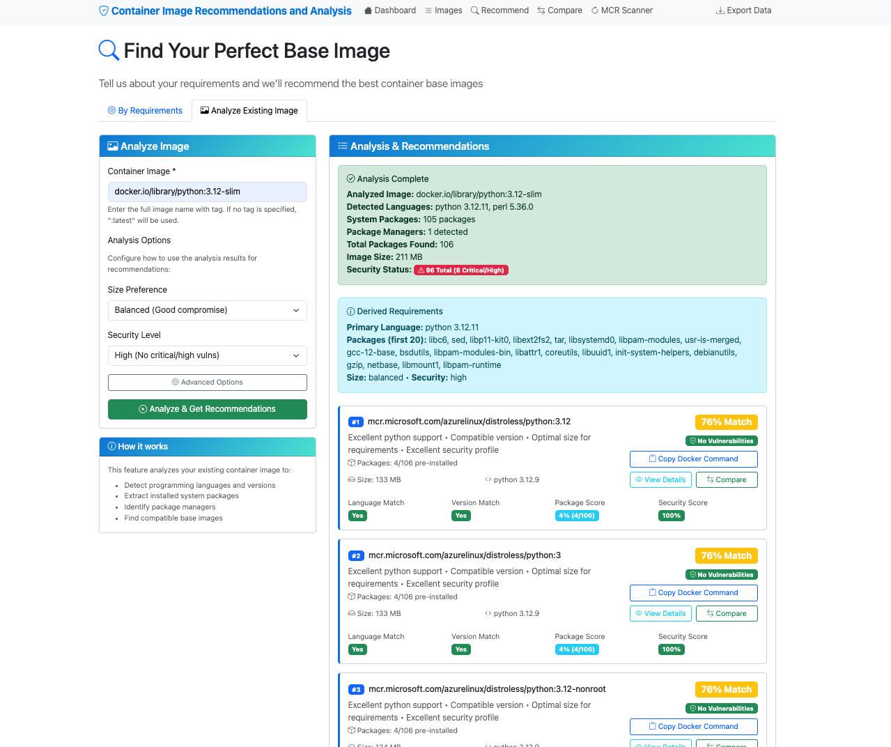
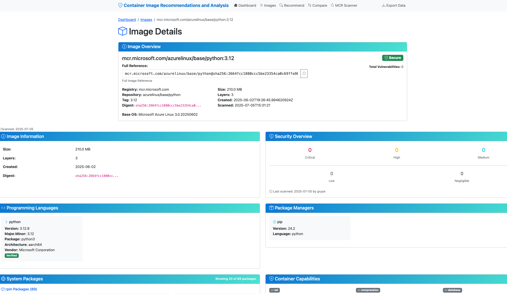
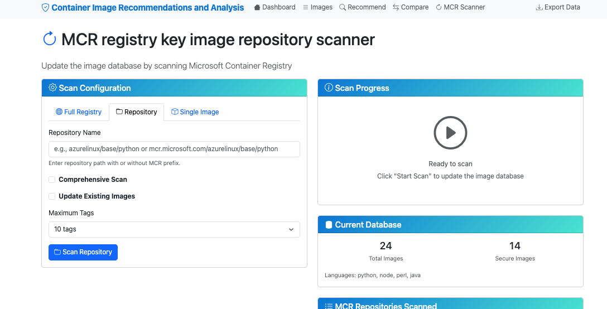

# Azure Linux Base Image Tool - Web UI

A user-friendly web interface for the Azure Linux Base Image Recommendation Tool, making it accessible to users who prefer a graphical interface over the command line.

## Features

### 🏠 Dashboard
- Overview of database statistics
- Quick access to key features
- Security metrics at a glance
- Language distribution summary

### 🔍 Image Recommendation
- Interactive form for specifying requirements
- Real-time recommendations with scoring
- Detailed reasoning for each recommendation
- Copy Docker commands with one click

### 📋 Image Browser
- Paginated list of all scanned images
- Filter by language and security level
- Search functionality
- Detailed view for each image

### 🔄 Registry Scanner
- Web-based interface for scanning Microsoft Container Registry
- Progress tracking and status updates
- Configurable scan options
- Automatic cleanup of temporary Docker images

## Usage Guide

### Getting Recommendations

1. Navigate to the **Recommend** page
2. Fill out the requirements form:
   - Select your programming language
   - Specify version requirements (optional)
   - List required packages (optional)
   - Choose size preference
   - Set security level
3. Click "Get Recommendations"
4. Review the ranked recommendations with detailed scoring
5. Copy Docker commands or view detailed image information

### Browsing Images

1. Navigate to the **Images** page
2. Use filters to narrow down results:
   - Language filter
   - Security filter (secure/safe/vulnerable/all)
3. Click on any image for detailed information
4. Use pagination to browse through all images

### Scanning the Registry

1. Navigate to the **Scan Registry** page
2. Configure scan options:
   - Enable comprehensive scan for detailed security analysis
   - Choose to update existing images
   - Set maximum tags per repository
3. Click "Start Scan" and monitor progress
4. View results and updated statistics

## Web UI Screenshots & Feature Walkthrough

### Dashboard Overview

The dashboard provides a comprehensive overview of your container image database, including:
- **Database Statistics**: Total images scanned, package counts, and security metrics
- **Language Distribution**: Visual breakdown of programming language support across images
- **Security Overview**: Summary of vulnerability counts and security levels
- **Quick Navigation**: Easy access to major features (Recommend, Browse Images, Scan Registry)

### Existing Image Analysis & Recommendations

The "Recommend based on existing image" feature allows you to analyze your current container image and get better alternatives:
- **Existing Image Analysis**: Supply a Docker image reference to analyze its characteristics
- **Automated Discovery**: Detects programming languages, packages, and vulnerabilities
- **Intelligent Alternatives**: Ranked secure base image candidates
- **Security Improvements**: Shows vulnerability reduction potential
- **Seamless Migration**: Strives for compatibility while improving security posture

### Custom Requirements Recommendation
The default recommendation view provides a comprehensive form to specify exact requirements:
- **Language Selection** (Python, Node.js, Java, Go, .NET, etc.)
- **Version Specification** (optional constraints)
- **Package Dependencies** list
- **Size Preferences** (minimal / balanced / full)
- **Security Level** thresholds
- **Smart Matching** with detailed scoring breakdown

### Recommendation Comparison

Highlights differences between current and candidate images:
- Side-by-side metrics
- Vulnerability reduction insights
- Size trade-offs
- Migration guidance

### Image Browser and Search

Browse & filter scanned images:
- Pagination
- Language / security filters
- Free-text search
- Quick metric overview + drill-down

### Detailed Image Information

In-depth details for a selected image:
- Metadata (tags, size, registry, created date)
- Vulnerability breakdown
- Installed packages & runtimes
- Detected languages + versions
- Recommendation context stats

### Registry Scanning Interface

Interactive scanning:
- Single image scan
- Comprehensive vs quick mode
- Progress logs
- Error handling feedback

### Repository Scanning

Batch operations:
- Multiple images / repos
- Tag limits (`max_tags`)
- Update existing control
- Real-time progress

### Comprehensive Registry Scanning

Full coverage features:
- All configured repositories
- Auto discovery of new versions
- Scheduling potential (future)
- Efficient resource usage

---
See also:
- Nightly Recommendations: `../docs/nightly_recommendations.md`
- Ranking Logic: `../docs/recommendations.md`
- Architecture: `../docs/images/architecture.md`
